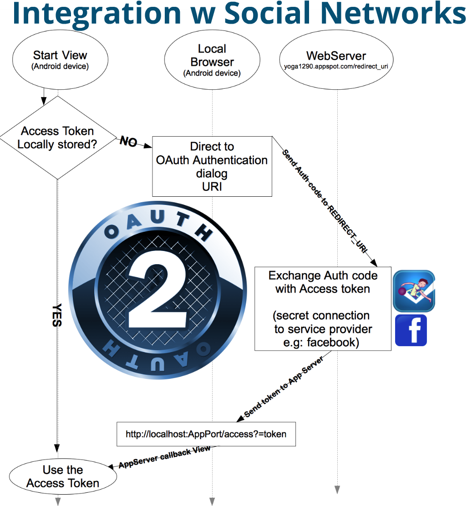
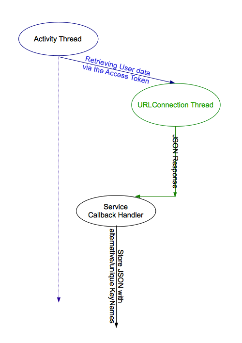
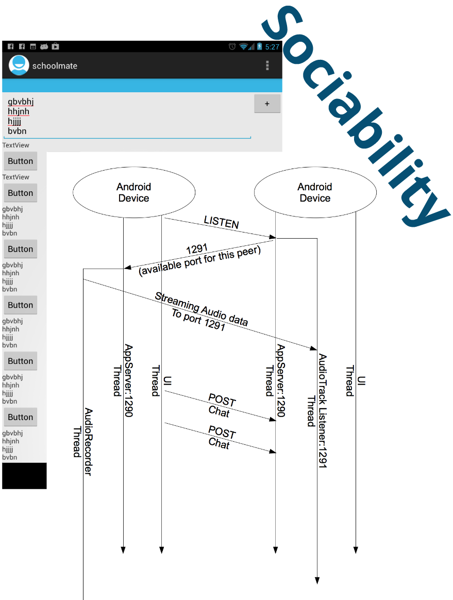
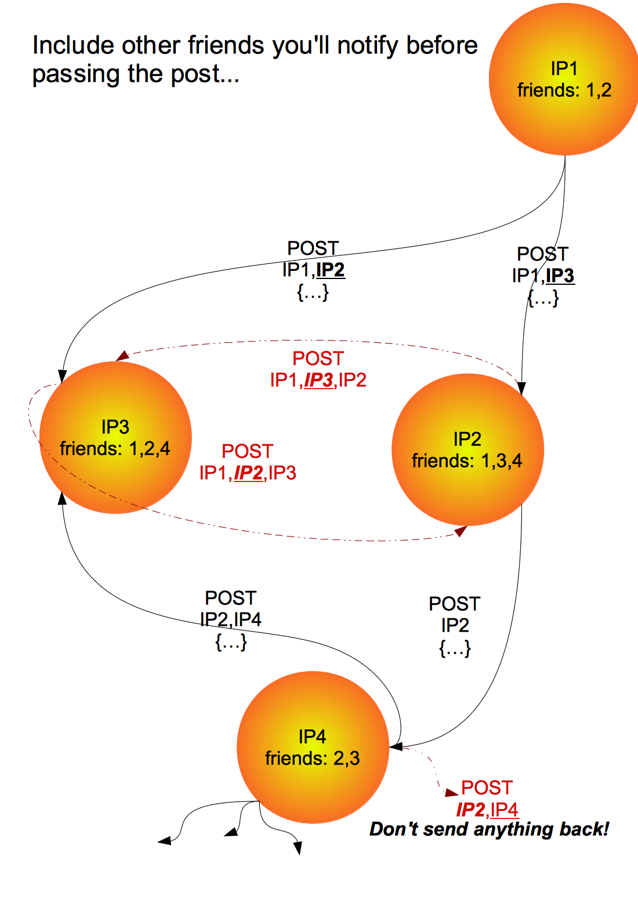
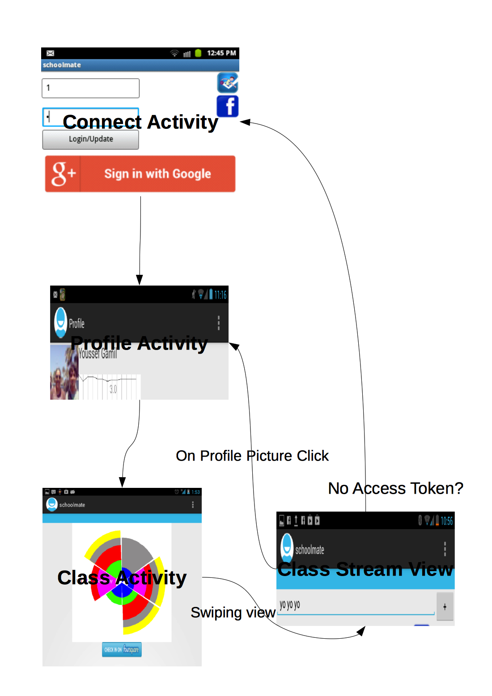

# URLConnections in UI-Thread

URLConnections are carried on separate threads and UI updates are packed in a new thread that will be queued and "runOnUiThread".

[URLThread](src/yoga1290/schoolmate/URLThread.java) creates an in depended URLConnection thread , read string input and when it calls back to **URLCallBack(String response)** in a given class that implements the [interface URLThread_CallBack](src/yoga1290/schoolmate/URLThread.java#L18) 

     final Activity currentActivity=this;
     new URLThread("URL HERE", new URLThread_CallBack() 
     { 
     	@Override 
     	public void [URLCallBack](src/yoga1290/schoolmate/URLThread.java) (String response) 
     	{ 
    		//queue this back on in the UI 
    		currentActivity.runOnUiThread
    		( 
    			new Runnable() 
    			{ 
    				@Override 
    				public void run() 
    				{ 
    					findViewById(R.id.SOME_UI_Comp) 
    						.doSomething(); 
    				} 
    			} 
    		); 
    	}
    }, "Optional POST DATA HERE,otherwise GET is used").start();

# [Connect](src/yoga1290/schoolmate/Connect.java)

+	Locally stored file, used for storing user data for later use and transfer data between Activities
+	Implementation: **getData():JSONObject** & **setData(JSONObject):void** in [Connect](src/yoga1290/schoolmate/Connect.java)

# [In-App Server](src/yoga1290/schoolmate/Server.java)

In-App Socket Server that handles couple of things:

+	If OAuth permission dialog was accepted, Service provider will make callback to the Web server (my AppEngine) handling the access token, the web server will later on pass the access token to the in-App Server [localhost:1290?ServiceName_HERE?access_token=TOKEN_HERE](src/yoga1290/schoolmate/Server.java#L605) where the user access token will be extracted.

+	Later, the access token is used to establish a URLConnection to retrieve the users data (e.g: Facebook/Foursqaure ID)… but KEYS from their JSON responses may clash with others in the [Connect.json](src/yoga1290/schoolmate/Connect.java)… so, before storing any data, there will be URLConnection CallBack Handlers to avoid JSON Keys collision

+	**Sociability (Audio/Messaging)**

When the in-App Server accepts a client, it uses the 1st line of input as an [**CMD**](src/yoga1290/schoolmate/Server.java#L506)

Raw Audio data is streamed in case of the **LISTEN** [**CMD**](src/yoga1290/schoolmate/Server.java#L506) that is played on separate AudioTrack [DataTransferThread](src/yoga1290/schoolmate/Server.java#L405)

[PCM-16](http://en.wikipedia.org/wiki/Pulse-code_modulation) constants are stored in [AudioProperties class](src/yoga1290/schoolmate/Server.java#L47)  

My implementation is very close to what's on [Google Blog](http://eurodev.blogspot.com/2009/09/raw-audio-manipulation-in-android.html) but I don't care about saving data

+	**Avoiding duplicated messages**

If it's receiving a **POST** or a **LISTEN** command,then it'll add its address to the received list before passing the data to other peers that aren't mentioned in the next line.

# Charts

+	[getClassTimetable](src/yoga1290/schoolmate/Charts.java#L55)
+	[getGPAGraph](src/yoga1290/schoolmate/Charts.java#L104)

# UI

+	[Connect/MainActivity](src/yoga1290/schoolmate/MainActivity.java) , It should be starting as the very 1st view and whenever there's a need for an access token

+	[ProfileActivity](src/yoga1290/schoolmate/ProfileActivity.java) , starts after the Connect Activity and on profile picture click in the [view_class_stream](src/yoga1290/schoolmate/view_class_stream.java)

+	[ClassActivity](src/yoga1290/schoolmate/ClassActivity.java) , starts on button press in the **ProfileActivity**, having some Swipping-Views; [view_class_details](src/yoga1290/schoolmate/view_class_details.java) to show data about class with [current_class](src/yoga1290/schoolmate/view_class_details.java#L31) as an id, [view_class_stream](src/yoga1290/schoolmate/view_class_stream.java) view for displaying the received messages and social sharing.

# WebServer

+	[Google AppEngine & NoSQL datastore](AppEngine/schoolmate.java)
+	[Server + Oracle SQL](WebServer/DBtest.java)

+	GET method for getters & POST method w id/pin 
Example of requests/responses for getters & setters:
+	GET [/schoolmate/student?id=…&pin=…](http://yoga1290.appspot.com/schoolmate/student?id=1&pin=1)
>	{
>		"classes":"1,2,3,…",
>		"fbid":"[870205250](http://facebook.com/870205250)"
>	}
>>	classes: IDs of joined classes
>>	fbid: Facebook id; used to send notifications

+	GET /schoolmate/staff?id=…&pin=…

+	GET [/schoolmate/class?id=…](http://yoga1290.appspot.com/schoolmate/class?id=1)
>	{
>		"schedule":"39,100,25,94,110,74,…",
>		"students":"1,2,3,…"
>	}
>>	students: IDs of students in this class
>>	used for generating [charts](src/yoga1290/schoolmate/Charts.java) where (schedule) is a  6-element array representing the 6 daily periods, each integer is a binary mask in form of 0bSMTWtFs (Sunday,Monday,Tuesday,Wednesday,thursday,Friday & saturday in order)

+ POST /schoolmate/student?id=…&pin=…
+ POST /schoolmate/staff?id=…&pin=…
+ POST /schoolmate/class?id=…

# On going

I'm switching to Bluetooth Socket Server connection; more independent and w a fixed address.
+	Bluetooth device discovery implemented in [ClassActivity](src/yoga1290/schoolmate/ClassActivity.java#L108)
+	[BluetoothServer](src/yoga1290/schoolmate/Server.java#L686) as [Server](src/yoga1290/schoolmate/Server.java#L654)
+	[BluetoothServerRequestHandler](src/yoga1290/schoolmate/Server.java#L811) as [ServerRequestHandler](src/yoga1290/schoolmate/Server.java#L470)