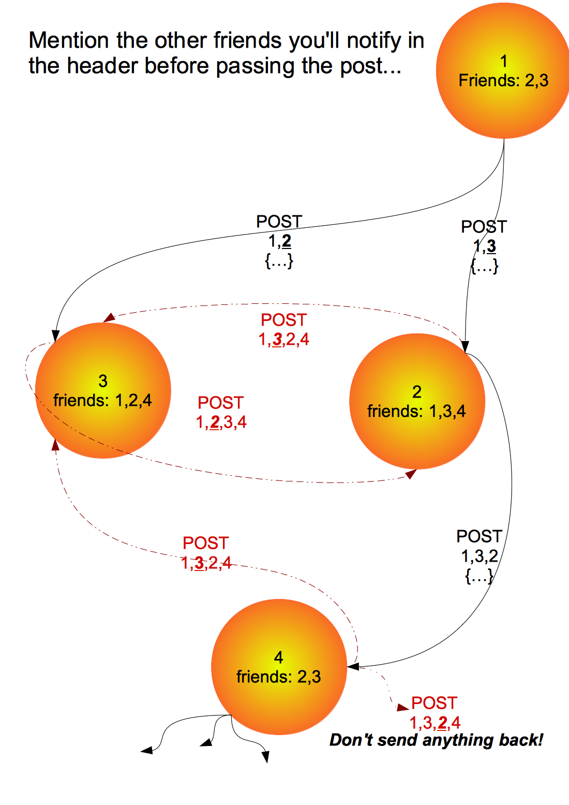

>	May link text to source files later!

# Authorizing:

At any point in the App where the Access Token is needed and couldn't be retrieved through the static getData() function in [Connect](https://github.com/yoga1290/schoolmate/blob/master/src/yoga1290/schoolmate/Connect.java) , a new [ConnectActivity](https://github.com/yoga1290/schoolmate/blob/master/src/yoga1290/schoolmate/ConnectActivity.java) Activity is started asking user to pick a service for authorization. 

Data are locally stored in form of JSON in the connect.txt (..not in the local DB,for now,for some debugging reasons)
…Actually, this is cute as most of social networks responses are in JSON w few fields collisions here so I'm storing whatever comes to hand & ask for [ConnectActivity](src/yoga1290/schoolmate/ConnectActivity.java) is smth is missing! :)

The in-App [Server](src/yoga1290/schoolmate/Server.java) will be notified when the native browser is redirected to "http://localhost:1290/SOME_SERVICES?access_token=TOKEN_TO_BE_STORED"..as explained in the chart

# Audio/Chat protocol

Actually, there are still some problems here… 1st time I used to loop for an available data port to start a new Thread that plays the received AudioTrack bytes, it gets noisy over time (at least you can hear the audio in my old [blog post](http://yoga1290.blogspot.com/2013/02/rocking-trip-sharing-audiotracks-across.html) ) so, I thought to prevent the overlapping noise by providing a unique data port per peer (IP as key)…but, this made it even worse :D!..while a peer is sending new data, it crushed w old thread using the same port for playing audio & none of new & old thread will continue working… (may be,I should rollback if I can't find better solution!)

## Avoiding duplicates:

+	don't send anything back
+	ignore posts coming from 2 or more friends/followers
+	SOMETHING IS STILL MISSING

# Data Visualization

These charts are generated through static functions in [Charts](https://github.com/yoga1290/schoolmate/blob/master/src/yoga1290/schoolmate/Charts.java) where you can generate it anytime, any place & in any view!

# Server-side API

Meanwhile, I'm currently testing requests/responses using [AppEngine Java class](AppEngine/schoolmate.java),besides handling the OAuth, these are the URIs I'm calling for data retrieval:

+ GET [/schoolmate/student?id=…&pin=…](http://yoga1290.appspot.com/schoolmate/student?id=1&pin=1)
>	{"classes":"1,2,3"}
>>	classes: IDs of joined classes

+ GET /schoolmate/staff?id=…&pin=…

+ GET [/schoolmate/class?id=…](http://yoga1290.appspot.com/schoolmate/class?id=1)
>	{"schedule":"39,100,25,94,110,74"}
>>	used for generating [charts](src/yoga1290/schoolmate/Charts.java) where (schedule) is a  6-element array representing the 6 daily periods, each integer is a binary mask in form of 0bSMTWtFs (Sunday,Monday,Tuesday,Wednesday,thursday,Friday & saturday in order)

+ POST /schoolmate/student?id=…&pin=…
+ POST /schoolmate/staff?id=…&pin=…
+ POST /schoolmate/class?id=…